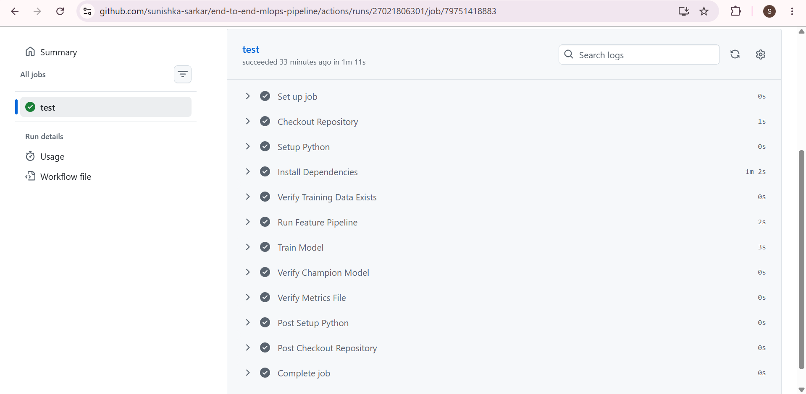
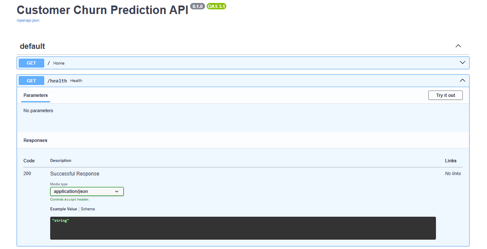
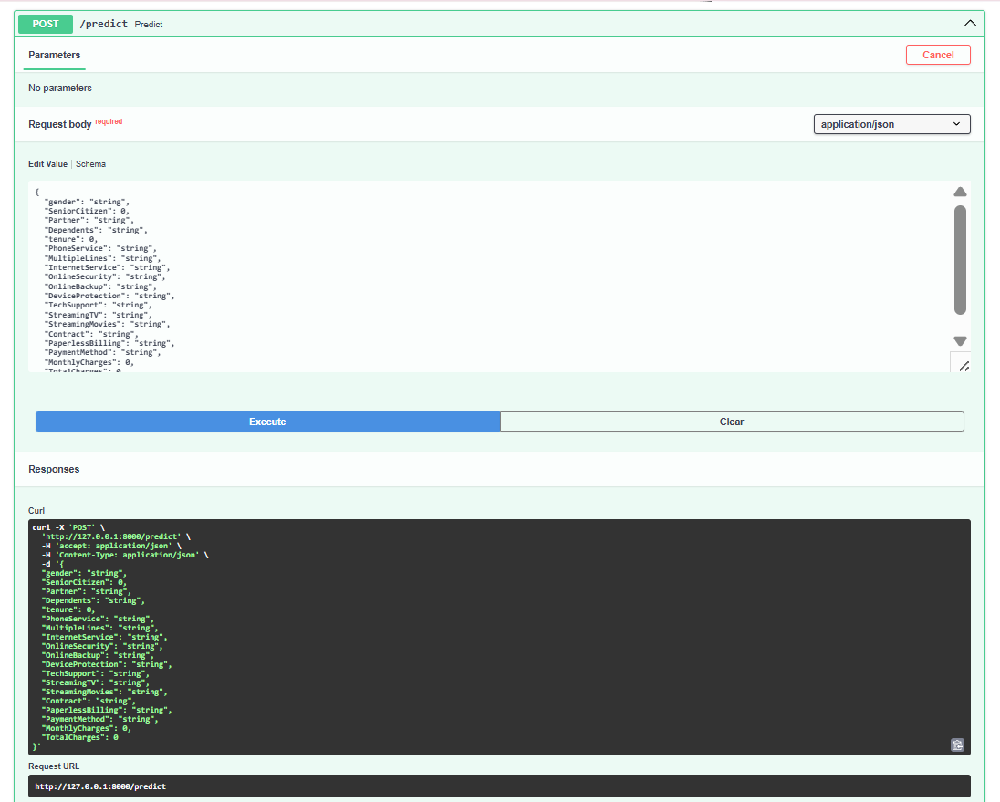
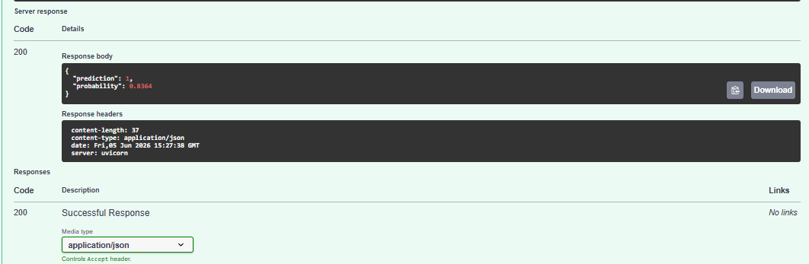
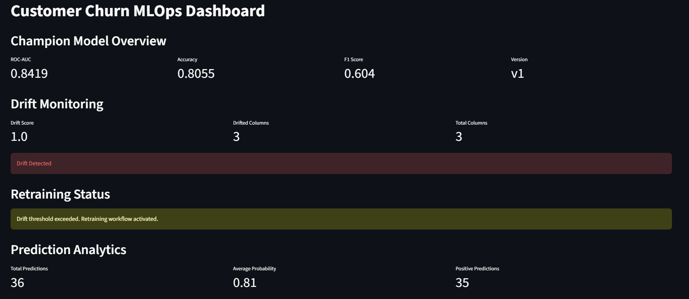
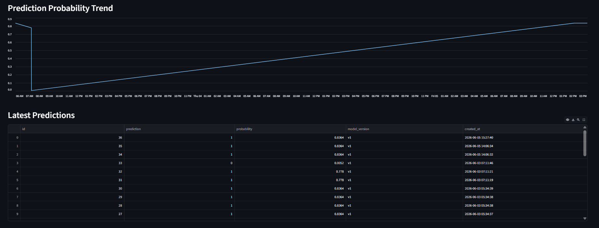
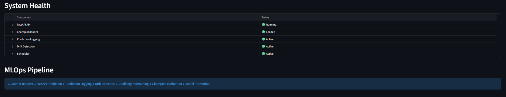
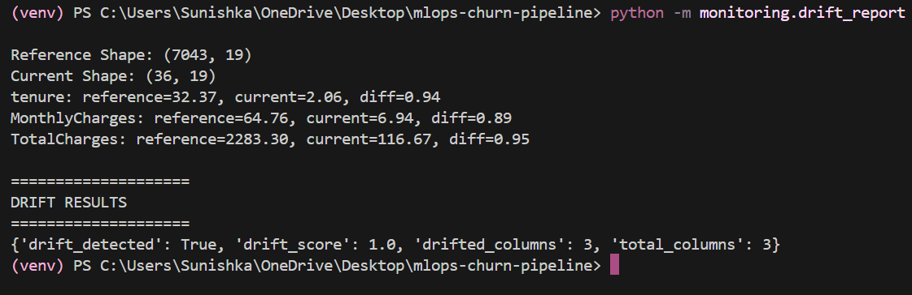

# End-to-End Customer Churn MLOps Pipeline


## Overview

This project implements an end-to-end MLOps pipeline for customer churn prediction using the IBM Telco Customer Churn dataset. The system covers the complete machine learning lifecycle including feature engineering, model training, experiment tracking, model serving, prediction logging, drift detection, automated retraining, monitoring, and CI/CD automation.

The project demonstrates how machine learning systems can be built, monitored, maintained, and continuously improved in a production-like environment.

---

## Key Features

### Data Processing

* Data cleaning and preprocessing
* Missing value handling
* Feature engineering pipeline
* One-hot encoding and feature scaling
* Parquet-based feature storage

### Model Development

* Logistic Regression
* Random Forest
* XGBoost
* Automated model evaluation
* Champion-Challenger model strategy

### Experiment Tracking

* MLflow integration
* Metric logging
* Parameter tracking
* Experiment comparison

### Model Serving

* FastAPI REST API
* Interactive Swagger documentation
* Health monitoring endpoint
* Real-time inference endpoint

### Monitoring

* Prediction logging with SQLite
* Data drift detection
* Drift score monitoring
* Automated monitoring scheduler

### Dashboard

* Streamlit monitoring dashboard
* Model performance tracking
* Prediction analytics
* System health overview

### DevOps

* Docker support
* GitHub Actions CI pipeline
* Automated training validation
* Artifact verification

---

## Pipeline Architecture

```text
Raw Data
    ↓
Feature Engineering
    ↓
Feature Store
    ↓
Model Training
    ↓
MLflow Tracking
    ↓
Champion Model
    ↓
FastAPI Serving
    ↓
Prediction Logging
    ↓
Monitoring Dashboard
    ↓
Drift Detection
    ↓
Automated Retraining
    ↓
Champion Promotion
```

---

## Model Performance

| Metric    | Value  |
| --------- | ------ |
| Accuracy  | 80.55% |
| Precision | 65.72% |
| Recall    | 55.88% |
| F1 Score  | 60.40% |
| ROC-AUC   | 84.19% |

---

## Technology Stack

### Machine Learning

* Python
* Scikit-Learn
* XGBoost
* Pandas
* NumPy

### MLOps

* MLflow
* FastAPI
* Streamlit
* SQLAlchemy

### Storage

* SQLite
* Parquet

### DevOps

* Docker
* GitHub Actions

---

## Project Structure

```text
end-to-end-mlops-pipeline/
│
├── data/
├── database/
├── dashboard/
├── features/
├── monitoring/
├── orchestration/
├── retraining/
├── serving/
├── tests/
├── training/
├── screenshots/
├── .github/workflows/
│
├── Dockerfile
├── docker-compose.yml
├── requirements.txt
└── README.md
```

---

## GitHub Actions CI Pipeline

The CI workflow automatically:

* Installs dependencies
* Builds features
* Trains models
* Verifies champion model artifacts
* Validates training outputs



---

## API Documentation

### GET Endpoints

FastAPI automatically generates interactive API documentation.



### Prediction Endpoint

The model exposes a POST endpoint for real-time customer churn predictions.



---

## Prediction Example

A sample prediction response from the deployed model.



---

## Monitoring Dashboard

### Model Metrics and Drift Monitoring



### Prediction Analytics



### System Health and Pipeline Status



---

## Drift Detection

The monitoring system continuously checks for changes in production data distributions and reports drift scores.



---

## Running Locally

### Clone Repository

```bash
git clone https://github.com/sunishka-sarkar/end-to-end-mlops-pipeline.git

cd end-to-end-mlops-pipeline
```

### Create Virtual Environment

```bash
python -m venv venv
```

Windows:

```bash
venv\Scripts\activate
```

### Install Dependencies

```bash
pip install -r requirements.txt
```

### Build Features

```bash
python features/build_features.py
```

### Train Models

```bash
python training/train.py
```

### Start FastAPI

```bash
uvicorn serving.app:app --reload
```

API Documentation:

```text
http://127.0.0.1:8000/docs
```

### Start Dashboard

```bash
streamlit run dashboard/app.py
```

Dashboard:

```text
http://localhost:8501
```

### Run Drift Detection

```bash
python -m monitoring.drift_report
```

---

## CI/CD

GitHub Actions automatically executes the machine learning workflow on every push to ensure reproducible training, artifact validation, and pipeline consistency.

---

## Future Improvements

* Kubernetes deployment
* Airflow orchestration
* Cloud deployment on AWS, Azure, or GCP
* Automated model registry integration
* Real-time monitoring alerts
* Full deployment automation

---

## Author

Sunishka Sarkar

Computer Science Engineering Student

Machine Learning | MLOps | Software Engineering
